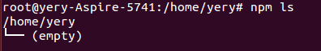
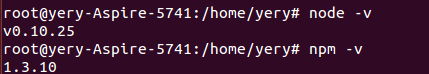
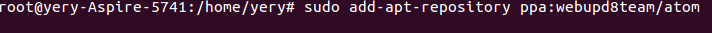
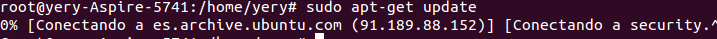
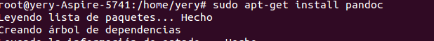

# Tutorial de ficheros Markdown
## Asignatura DSI(Desarollo de Sistemas Informaticos) ULL 2015/2016
### Alumno: Yeray Pérez Peraza

[Enlace a Google Plus](https://plus.google.com/u/0/103843506225178759595 "Enlace a Google Plus")

##En este tutorial vamos a ver como instalar diversas tecnologías
1. Node js
2. Express
3. Git
4. Atom
5. Pandoc

+ Empezamos por Node js

Primero abrimos la terminal de Ubuntu

Segundo: Escribimos la siguiente orden:

> sudo apt-get install nodejs

Tercero: Instalamos el node package manager, npm

> sudo apt-get install npm

Cuarto: Comprobamos la correcta Instalación:

> npm ls

Quinto: Comprobamos las versiones instaladas

> node -v
> npm -v

+  Express

Ponemos la siguiente orden en la terminal de Ubuntu:

> npm install express --save

+ Git

Para instalar Git, escribimos en la terminal de Ubuntu:

> apt-get install git

+ Atom
Para instalar Atom, escribimos en una terminal de Ubuntu lo siguiente:

>sudo add-apt-repository ppa:webupd8team/atom

>sudo apt-get update

>sudo apt-get install atom

+ Pandoc

Para instalar Pandoc, escribimos en la terminal de Ubuntu:

> sudo apt-get install pandoc

Usar pandoc:

>pandoc README -o example1.html
