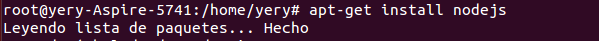
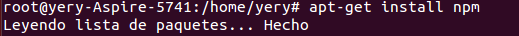

<meta http-equiv="Content-Type" content="text/html; charset=utf-8"/>
# Tutorial de NodeJS
## Asignatura DSI(Desarollo de Sistemas Informáticos) ULL 2015/2016
### Alumno: Yeray Pérez Peraza

+ Instalación nodeJS

1. Escribimos la siguiente orden:

> sudo apt-get install nodejs

2. Instalamos el node package manager, npm

> sudo apt-get install npm

+ Primer programa en nodejs

Vamos a aprender lo mas básico como hacer nuestro primer ejercicio en nodeJS (Hola Mundo).

1. Abrimos el editor de texto, en nuestro caso Atom.

2. En el editor escribimos :

> console.log("Hola Mundo");

Guardamos el fichero como holamundo.js

3. Ejecutamos nuestro programa

> node holamundo.js

Con esto finalizamos nuestra primera toma de contacto con nodejs.

Próximamente seguiremos explicando con mayor nivel de dificultad como se trabaja con nodeJS.
